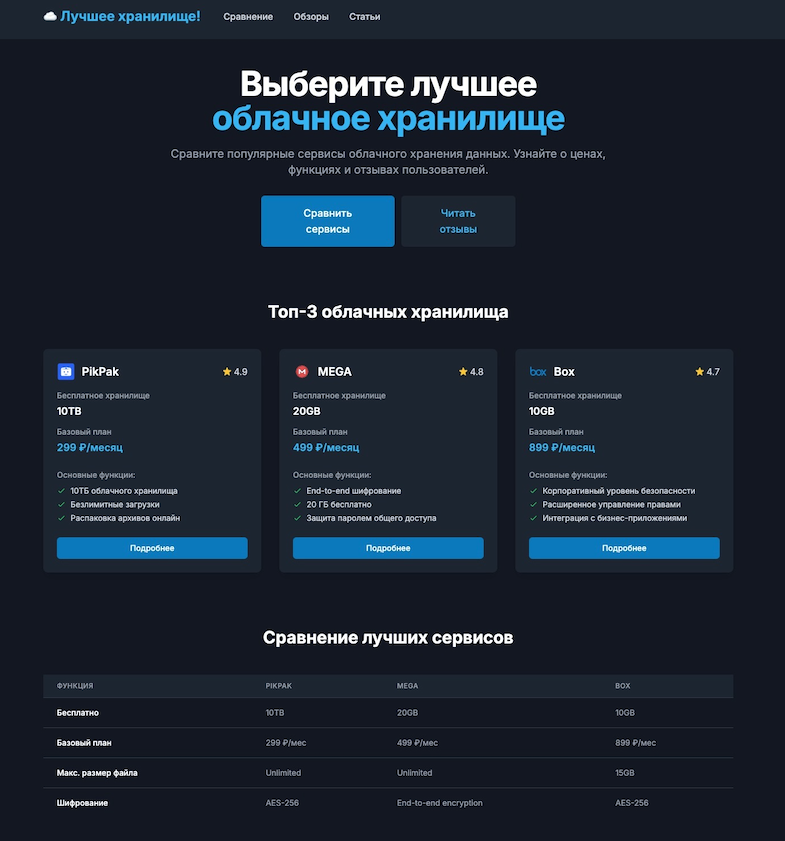

# ☁️ Лучшее хранилище! - Cloud Storage Comparison Platform



Link: https://topobloko.ru/

Git: https://github.com/temaprint/topobloko.ru.git

A comprehensive platform for comparing cloud storage services, built with Astro and Tailwind CSS. The platform provides detailed comparisons, reviews, and articles about various cloud storage solutions.

## 🚀 Features

- **Detailed Comparisons**: Compare cloud storage services by features, pricing, and security
- **User Reviews**: Real user reviews and ratings for each service
- **Expert Articles**: In-depth articles about cloud storage solutions
- **Dark Mode Support**: Full dark mode implementation
- **Responsive Design**: Works perfectly on all devices
- **Performance Optimized**: Built with Astro for optimal loading speeds

## 🛠️ Tech Stack

- [Astro](https://astro.build) - Static Site Generator
- [Tailwind CSS](https://tailwindcss.com) - Styling
- [TypeScript](https://www.typescriptlang.org) - Type Safety
- [@tailwindcss/typography](https://tailwindcss.com/docs/typography-plugin) - Article Styling
- [date-fns](https://date-fns.org) - Date Formatting
- [reading-time](https://www.npmjs.com/package/reading-time) - Article Reading Time

## 📦 Project Structure

```
/
├── public/
│   └── favicon.svg
├── src/
│   ├── components/
│   │   ├── ArticleCard.astro
│   │   ├── Header.astro
│   │   ├── ReviewCard.astro
│   │   ├── ReviewForm.astro
│   │   └── ServiceCard.astro
│   ├── content/
│   │   └── articles/
│   │       ├── best-cloud-storage-2024.md
│   │       ├── cloud-storage-security.md
│   │       ├── business-cloud-solutions.md
│   │       └── best-cloud-for-photos.md
│   ├── data/
│   │   ├── services.ts
│   │   └── services/
│   │       ├── box.json
│   │       ├── dropbox.json
│   │       ├── google-drive.json
│   │       ├── mega.json
│   │       ├── nextcloud.json
│   │       ├── onedrive.json
│   │       ├── pikpak.json
│   │       └── yandex-disk.json
│   ├── layouts/
│   │   └── Layout.astro
│   ├── pages/
│   │   ├── articles/
│   │   │   ├── index.astro
│   │   │   └── [slug].astro
│   │   ├── service/
│   │   │   └── [slug].astro
│   │   ├── comparison.astro
│   │   ├── index.astro
│   │   └── reviews.astro
│   ├── styles/
│   │   ├── article.css
│   │   └── global.css
│   └── types/
│       └── index.ts
└── package.json
```

## 🚀 Getting Started

1. Clone the repository:
```bash
git clone https://github.com/temaprint/topobloko.ru.git
```

2. Install dependencies:
```bash
npm install
```

3. Start the development server:
```bash
npm run dev
```

4. Open your browser and visit `http://localhost:4321`

## 📝 Available Scripts

- `npm run dev` - Start development server
- `npm run build` - Build for production
- `npm run preview` - Preview production build
- `npm run astro` - Run Astro CLI commands

## 🎨 Features Overview

### Cloud Service Comparison
- Detailed feature comparison
- Pricing analysis
- Storage capacity comparison
- Security features overview

### User Reviews
- Star ratings
- Detailed user feedback
- Service-specific reviews
- Review submission form

### Expert Articles
- In-depth analysis
- Security guides
- Business solutions
- Photography storage guides

### Responsive Design
- Mobile-first approach
- Dark mode support
- Accessible interface
- Optimized typography

## 🤝 Contributing

Contributions are welcome! Please feel free to submit a Pull Request.

## 📄 License

This project is licensed under the MIT License - see the LICENSE file for details.